<!--
  ═══════════════════════════════════════════════════════════════
  GLORYSID — TRAINER PROFILE
  Pokémon-themed, animated, pixel-art profile README.
  All animation lives inside ./assets/*.svg (self-contained,
  GitHub-safe). Generated by: node scripts/generate-assets.mjs
  ═══════════════════════════════════════════════════════════════
-->


<table width="100%">
<tr>
<td width="62%" valign="top">

  

</td>
<td width="38%" valign="top" align="center">

  

 

  

</td>
</tr>
</table>

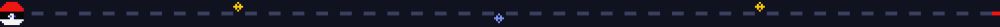


<table width="100%">
<tr>
<td width="38%" valign="top" align="center">


 

 

</td>
<td width="62%" valign="top">

**ANJALI SAPUTRA** — a trainer from Indonesia 🇮🇩 with a strange specialty: **teaching machines to do the boring stuff** so humans can go catch legendaries instead.

By day: automating things that shouldn't need humans. By night: building cool things nobody asked for (yet). Every repetitive task is just a wild Pokémon waiting to be caught.

 

<pre>
TRAINER VITALS
────────────────────────────────────────────
HP        ████████████████░░░░   80%
IDEAS     ███████████████████░   95%
COFFEE    ██████████████░░░░░░   70%
SLEEP     ████░░░░░░░░░░░░░░░░   20%  (critical!)
</pre>

</td>
</tr>
</table>


<table width="100%">
<tr>
<td width="28%" rowspan="2" valign="middle" align="center">

**BLAZE** · Blaziken
*Party lead. Ships the big features.*
<kbd>LV.88</kbd>

</td>
<td width="24%" valign="top" align="center">

**VOLT** · Pikachu
*Automates the boring stuff.*
<kbd>LV.99</kbd>

</td>
<td width="24%" valign="top" align="center">

**SHADOW** · Gengar
*Works the night shift. Obviously.*
<kbd>LV.86</kbd>

</td>
<td width="24%" valign="top" align="center">

**AURA** · Lucario
*Senses bugs from a mile away.*
<kbd>LV.84</kbd>

</td>
</tr>
<tr>
<td valign="top" align="center">

**FERRY** · Lapras
*Carries deploys across the sea.*
<kbd>LV.82</kbd>

</td>
<td valign="top" align="center">

**GLITCH** · Mew
*Rare commits only.*
<kbd>LV.???</kbd>

</td>
<td valign="top" align="center">

  

**? ? ?**
*EGG — a new project is hatching...*
<kbd>DAY CARE</kbd>

</td>
</tr>
</table>


<table width="100%">
<tr>
<td width="60%" valign="top">

- 🏆 **MAIN QUEST** — Make the machines do the boring stuff, forever. <kbd>ONGOING</kbd>
- ⚔️ **SIDE QUEST** — Grind the TypeScript moveset to LV.100. <kbd>ACTIVE</kbd>
- 🌙 **NIGHT RAID** — Build cool things nobody asked for. <kbd>EVERY NIGHT</kbd>
- 🤖 **GYM REMATCH** — Teach Roblox worlds to run themselves. <kbd>IN PROGRESS</kbd>
- 🥚 **DAY CARE** — A mysterious repo is hatching... <kbd>???</kbd>

</td>
<td width="40%" valign="top" align="center">

<pre>
CURRENT STATUS
──────────────────────────────
> coding:     TRUE
> location:   Indonesia 🇮🇩
> local time: probably late
> blockers:   none (yet)
</pre>

</td>
</tr>
</table>


  

<table width="100%">
<tr>
<td width="55%" valign="top">

**LEARNED MOVES**

    

 

    

</td>
<td width="45%" valign="top" align="center">

*This stack is an **EEVEE** — it evolves.*
*Currently: React & Next.js. Watch it adapt*
*to whatever the battle needs.*

</td>
</tr>
</table>


  

<table width="100%">
<tr>
<td width="56%" valign="top" align="center">

</td>
<td width="44%" valign="top" align="center">

<!--
  NOTE: this streak SVG is generated statically by
  .github/workflows/streak-stats.yml into profile/streak.svg.
  It 404s until the workflow runs for the first time (it auto-runs
  on push of that workflow file, then daily at 03:00 UTC).
-->

</td>
</tr>
</table>

<table width="100%">
<tr>
<td width="42%" valign="top" align="center">

</td>
<td width="58%" valign="top" align="center">

<!--
  NOTE: this snake GIF 404s until .github/workflows/snk.yml runs for the
  first time (Platane/snk pushes the asset to the `output` branch).
  Expected — it appears after the first workflow run.
-->

</td>
</tr>
</table>


<table width="100%">
<tr>
<td width="40%" valign="top" align="center">

*Do not make the GYARADOS angry.*
*(Please open an issue instead.)*

</td>
<td width="60%" valign="top">

**LINK CABLE DETECTED.** Open for trades (ideas), raid battles (pair programming), and co-op quests (collabs). If it can be automated, I want to hear about it.

  

  

</td>
</tr>
</table>

🔮 Open the SECRET PC

 

 
<b>MEWTWO joined your party.</b> EXP +9999. Thanks for scrolling this far, trainer.

